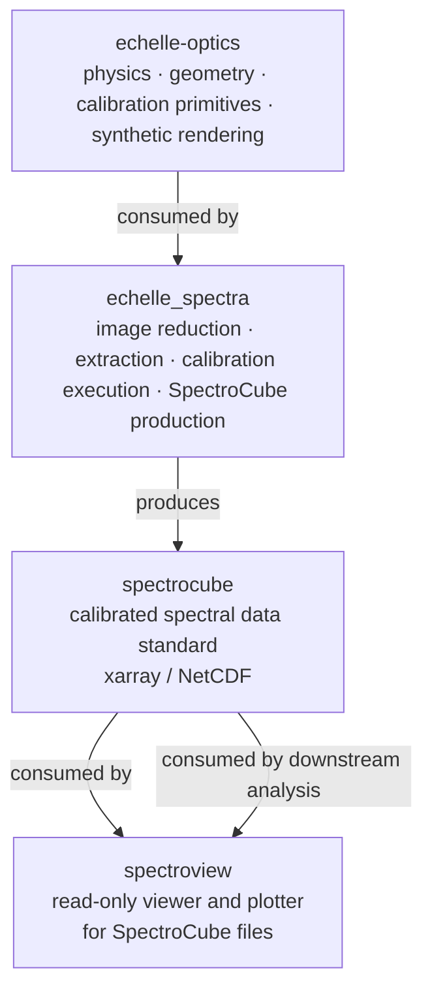

# Ecosystem

`echelle_optics` is one component in a small stack of related scientific packages.
This page describes how each repository fits into the overall workflow.

---

## Package roles



---

## echelle-optics

**Repository**: [github.com/queezz/echelle-optics](https://github.com/queezz/echelle-optics)

**Role**: reusable physics and geometry library

Provides:
- Echelle diffraction physics — Littrow approximation, order tables, dispersion
- Instrument profile system — configurable `EchelleSpectrometer` + empirical `DetectorGeometry`
- Wavelength calibration primitives — pixel→wavelength mapping structures
- Synthetic 2D detector image renderer — for development and calibration validation

Does **not** include:
- Real frame processing or extraction
- Production calibration fitting pipelines
- GUI or data visualization

---

## echelle_spectra

**Repository**: [github.com/queezz/echelle_spectra](https://github.com/queezz/echelle_spectra)  
**Docs**: [queezz.github.io/echelle_spectra](https://queezz.github.io/echelle_spectra)

**Role**: pipeline execution against real detector frames

Consumes `echelle_optics` for geometry and physics. Implements:
- Image loading and preprocessing (Andor SIF, FITS, raw formats)
- Arc-lamp line detection and centroid fitting
- Wavelength calibration fitting (arc centroids → polynomial solution)
- Order extraction (trace-following, optimal weighting, background subtraction)
- SpectroCube file production

This is where the actual instrument data meets the calibration infrastructure.

---

## spectrocube

**Repository**: [github.com/queezz/spectrocube](https://github.com/queezz/spectrocube)

**Role**: calibrated spectral data standard

Defines a single class `SpectroCube` wrapping an xarray Dataset with:
- Required `intensity` data variable and `wavelength` coordinate
- Five required metadata attributes (instrument, calibration type, units, medium, version)
- NetCDF serialization

Producer: `echelle_spectra`  
Consumers: `spectroview`, downstream analysis scripts

The standard is intentionally minimal — it does not encode instrument-specific
structure. Any package can produce or consume SpectroCube files without sharing
instrument code.

---

## spectroview

**Repository**: [github.com/queezz/spectroview](https://github.com/queezz/spectroview)

**Role**: read-only viewer and plotter for SpectroCube datasets

A lightweight GUI for inspecting calibrated spectral data:
- Frame slider, spectrum plot, region selector
- Known wavelength band overlays
- No calibration or fitting — consumer only

---

## Data flow across the stack

```
raw detector frame  (2D, .sif / .fits)
        │
        ▼  [echelle_spectra]
  arc-line detection + centroid fitting
        │
        │  uses [echelle_optics] geometry + physics
        ▼
  wavelength calibration solution
        │
        ▼  [echelle_spectra]
  order extraction → 1D calibrated spectrum
        │
        ▼  [spectrocube]
  SpectroCube .nc file
        │
        ▼  [spectroview / analysis scripts]
  visualization + analysis
```

---

## Adding a new instrument

A new cross-dispersed echelle instrument would be added as a profile in `echelle_optics`:

1. Measure a calibration frame → extract order center y-positions → save as `data/pattern_<name>_<date>.txt`
2. Add a factory function `<name>_echelle()` in `spectrometer.py`
3. Add a `load_<name>_geometry()` loader in `geometry.py`
4. Add tests for the new profile

No changes to `grating.py`, `synthetic.py`, or any other shared module are required.
`echelle_spectra` would then call the new profile functions to drive its extraction
pipeline.

---

## Related tools in the lab

See the [AK Lab software page](https://queezz.github.io/aklab-howto/other-tools/)
for the full list of related repositories, including `lhd-data`, `fulcheranalyzer`,
`bh-molecule`, and hardware control packages.
