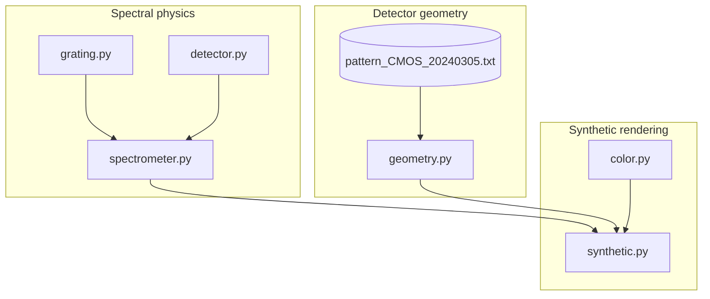

# Architecture

This page describes the module structure, data flow, and design boundaries in
`echelle_optics`. Future contributors and agents should read this before making
structural changes.

---

## Module map

```
echelle_optics/
├── grating.py        ← diffraction math (pure functions)
├── detector.py       ← pixel grid metadata (dataclass)
├── spectrometer.py   ← instrument model + order table
├── geometry.py       ← empirical curved order traces
├── synthetic.py      ← 2D image renderer
├── color.py          ← wavelength → RGB
└── data/
    └── pattern_CMOS_20240305.txt   ← measured order positions
```

---

## Dependency graph



---

## Layer responsibilities

### Layer 1 — Spectral physics

| Module | Responsibility |
|---|---|
| `grating.py` | Standalone functions: groove spacing, Littrow constant, central wavelength, dispersion, FSR |
| `detector.py` | `Detector` dataclass: pixel count, pixel size, derived mm dimensions |
| `spectrometer.py` | `EchelleGrating`, `EchelleSpectrometer`, `order_table()`, `lhd_cmos_echelle()` factory |

These modules are **independent of each other** except that `EchelleSpectrometer` holds
an `EchelleGrating` and a `Detector`. They have no dependency on geometry or rendering.

### Layer 2 — Detector geometry

| Module | Responsibility |
|---|---|
| `geometry.py` | Load calibration pattern, fit polynomial traces, expose `y_at(order, x)` |
| `data/*.txt` | Raw measured order y-positions (instrument-specific) |

`geometry.py` has **no dependency on spectral physics**. It answers a purely spatial
question: given an order index and an x pixel, what y pixel is the order center on?

### Layer 3 — Synthetic rendering

| Module | Responsibility |
|---|---|
| `synthetic.py` | Combine physics (x-positions) and geometry (y-positions) into a 2D float or RGB array |
| `color.py` | Map wavelength (nm) to linear RGB for display |

The renderer imports from both Layer 1 and Layer 2 but does not modify either. It is
the only place where x and y coordinates are combined.

---

## Key design boundaries

**Do not merge the geometry layer into the spectrometer model.**

`EchelleSpectrometer` knows about wavelengths and dispersions. It does not know about
detector pixel positions. This separation exists because:

1. The geometry is instrument-specific and empirical — it would pollute a general
   grating model.
2. The geometry may be replaced (different calibration date, different instrument)
   without touching the physics model.
3. Future wavelength calibration code will also need to consume geometry independently
   of the grating model.

**Do not compute curvature from grating theory inside the renderer.**

Curvature is measured, not derived. The `IDEAL_STRAIGHT` mode exists for testing, not
as a physical default. Never silently fall back to straight orders when curved geometry
is available.

---

## Data flow: emission-line rendering

```
lines (wavelengths, nm)
        │
        ▼
physical_order_from_wavelength()          ← grating.py
        │
        ▼
wavelength → x pixel                      ← dispersion from spectrometer.py
        │
        ▼
(order, x) → y pixel                      ← geometry.py or ideal spacing
        │
        ▼
place Gaussian PSF at (x, y)              ← synthetic.py
        │
        ▼
2D float array  (H × W)
```

---

## Public API surface

The `__init__.py` re-exports:

```python
from echelle_optics import (
    # Instrument factory
    lhd_cmos_echelle,

    # Grating math
    groove_spacing_nm, littrow_constant_nm, central_wavelength_nm,
    physical_order_from_wavelength, linear_dispersion_nm_per_px,
    free_spectral_range_nm,

    # Detector
    Detector,

    # Spectrometer
    EchelleGrating, EchelleSpectrometer,

    # Geometry
    GeometryMode, OrderTrace, DetectorGeometry,
    load_lhd_cmos_geometry, load_lhd_cmos_pattern, fit_order_traces,

    # Rendering
    render_echelle_lines, render_white_light,

    # Color
    wavelength_to_rgb,
)
```

---

## What is not in this package

| Missing piece | Reason |
|---|---|
| Wavelength calibration | Fitting arc lines to pixel coordinates — planned as a separate module or package |
| Spectral extraction | Summing counts along a curved order trace — out of scope |
| Full optical raytrace | This is not Zemax; physics is Littrow approximation only |
| Multi-instrument config | Only LHD CMOS bundled; extension is by user code |
| Flux / throughput model | Blaze efficiency, QE, atmospheric transmission — out of scope |
