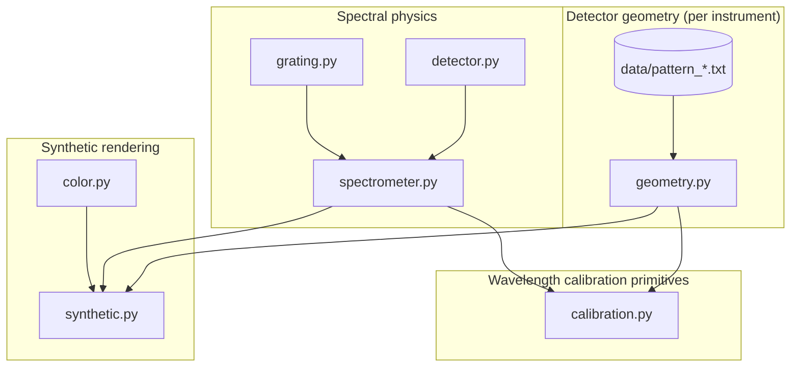

# Architecture

This page describes the module structure, data flow, and design boundaries in
`echelle_optics`. Future contributors and agents should read this before making
structural changes.

---

## Module map

```
echelle_optics/
├── grating.py        ← EchelleGrating dataclass + diffraction math
├── detector.py       ← Detector dataclass (pixel grid metadata)
├── spectrometer.py   ← EchelleSpectrometer, order table, instrument factories
├── geometry.py       ← empirical curved order traces
├── synthetic.py      ← 2D image renderer
├── color.py          ← wavelength → RGB
└── data/
    ├── pattern_CMOS_20240305.txt        ← measured order positions
    └── Th_wavelength_CMOS_20240305.txt  ← measured wavelength lookup table
```

---

## Dependency graph



---

## Layer responsibilities

### Layer 1 — Spectral physics

| Module | Responsibility |
|---|---|
| `grating.py` | `EchelleGrating` dataclass + pure functions: groove spacing, Littrow constant, central wavelength, dispersion, FSR |
| `detector.py` | `Detector` dataclass: pixel count, pixel size, derived mm dimensions |
| `spectrometer.py` | `EchelleSpectrometer`, `order_table()`, instrument factory functions (`lhd_cmos_echelle()`) |

`grating.py` owns both the grating parameter container (`EchelleGrating`) and all
grating math. `spectrometer.py` assembles grating + detector into a complete instrument
model and generates order tables. These modules have no dependency on geometry or rendering.

### Layer 2 — Detector geometry

| Module | Responsibility |
|---|---|
| `geometry.py` | Load calibration pattern, fit polynomial traces, expose `y_at(order, x)` |
| `data/*.txt` | Raw measured order y-positions (instrument-specific) |

`geometry.py` has **no dependency on spectral physics**. It answers a purely spatial
question: given an order index and an x pixel, what y pixel is the order center on?

### Layer 3 — Synthetic rendering

| Module | Responsibility |
|---|---|
| `synthetic.py` | Combine physics (x-positions) and geometry (y-positions) into a 2D float or RGB array |
| `color.py` | Map wavelength (nm) to linear RGB for display |

The renderer imports from both Layer 1 and Layer 2 but does not modify either. It is
the only place where x and y coordinates are combined.

### Layer 4 — Wavelength calibration primitives

| Module | Responsibility |
|---|---|
| `calibration.py` | `WavelengthSolution` data structure, `wavelength_at(x, order)`, `pixel_at(wavelength, order)`, residual containers |

This layer consumes both Layer 1 (dispersion for initial guesses) and Layer 2
(geometry traces for 2D mapping). It provides the data structures that synthetic
rendering and extraction pipelines can consume. Fitting or correcting arc-line
centroids from real detector frames is the responsibility of `echelle_spectra`.

---

## Key design boundaries

**Physics and geometry are independent.**

`EchelleSpectrometer` knows about wavelengths and dispersions. `DetectorGeometry` knows
about pixel y-positions. Neither knows about the other. This separation means:

- Geometry can change (new calibration date, different instrument) without touching physics
- New instruments reuse the same physics layer with different geometry data
- Wavelength calibration code can consume both layers without coupling them

**Geometry is empirical, not derived.**

Order curvature is measured from real calibration frames, not computed from optics.
`IDEAL_STRAIGHT` mode is for tests only — never use it as a production default.

**Calibration primitives belong here; pipelines belong in `echelle_spectra`.**

`echelle_optics` provides the data structures (`WavelengthSolution`) and evaluation
methods (`wavelength_at()`). `echelle_spectra` populates those structures by fitting
arc-lamp observations. The boundary is: data model here, execution there.

---

## Data flow: emission-line rendering

```
lines (wavelengths, nm)
        │
        ▼
physical_order_from_wavelength()          ← grating.py
        │
        ▼
wavelength → x pixel                      ← calibration.py when provided,
                                             otherwise spectrometer.py
        │
        ▼
(order, x) → y pixel                      ← geometry.py or ideal spacing
        │
        ▼
place Gaussian PSF at (x, y)              ← synthetic.py
        │
        ▼
2D float array  (H × W)
```

---

## Public API surface

The `__init__.py` re-exports:

```python
from echelle_optics import (
    # Instrument factory
    lhd_cmos_echelle,

    # Grating (parameter container + math — all in grating.py)
    EchelleGrating,
    groove_spacing_nm, littrow_constant_nm, central_wavelength_nm,
    physical_order_from_wavelength, linear_dispersion_nm_per_px,
    free_spectral_range_nm,

    # Detector
    Detector,

    # Spectrometer (instrument assembly + order table)
    EchelleSpectrometer,

    # Geometry
    GeometryMode, OrderTrace, DetectorGeometry,
    load_lhd_cmos_geometry, load_lhd_cmos_pattern, fit_order_traces,

    # Wavelength calibration primitives
    CalibrationLine, OrderWavelengthFit, WavelengthSolution,
    load_lhd_cmos_calibration, fit_wavelength_solution,
    load_lhd_cmos_wavelength_solution,

    # Rendering
    render_echelle_lines, render_white_light,

    # Color
    wavelength_to_rgb,
)
```

---

## What is not in this package

| Item | Where it belongs |
|---|---|
| Arc-line fitting against real detector frames | `echelle_spectra` |
| Full spectral extraction pipelines | `echelle_spectra` |
| SpectroCube file production | `echelle_spectra` (using `spectrocube`) |
| GUI visualization | `spectroview` |
| Full optical raytrace | Out of scope — physics is Littrow approximation only |
| Flux / throughput model | Blaze efficiency, QE, atmospheric transmission — out of scope |

See [Ecosystem](../development/ecosystem.md) for the full picture of how the packages
relate to each other.
